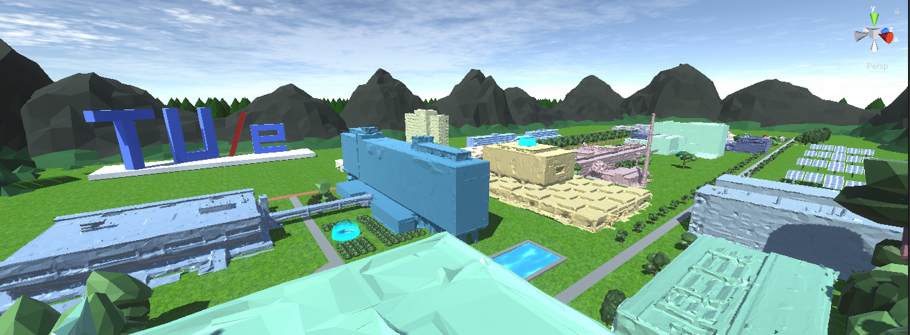
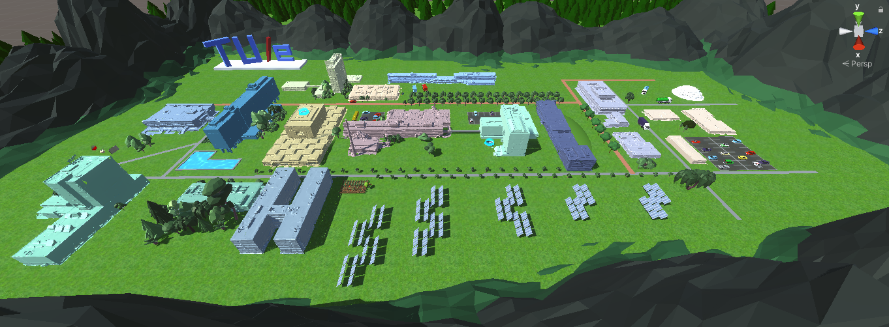
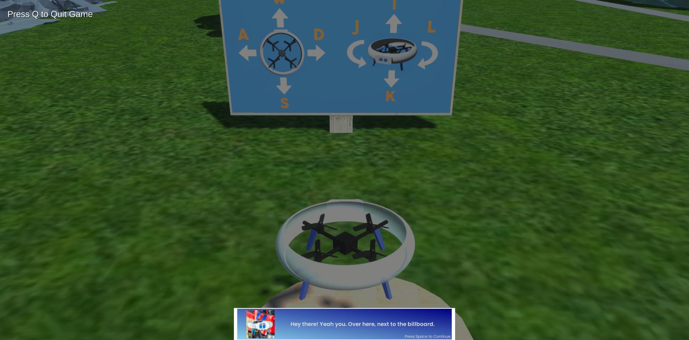
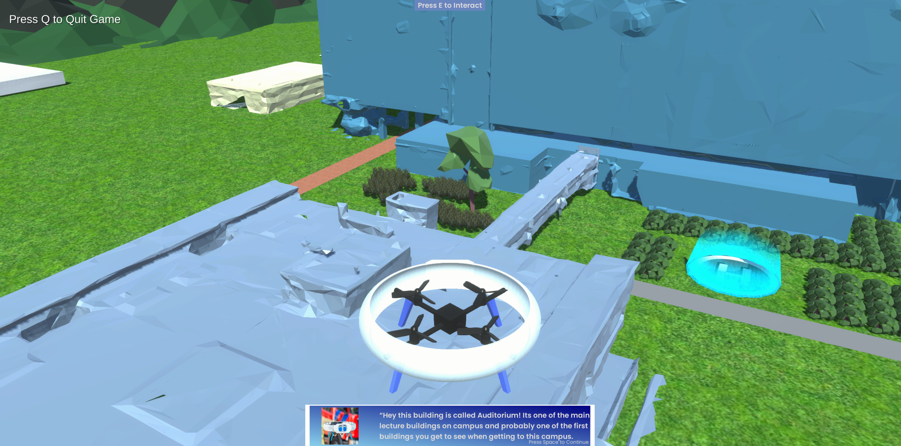
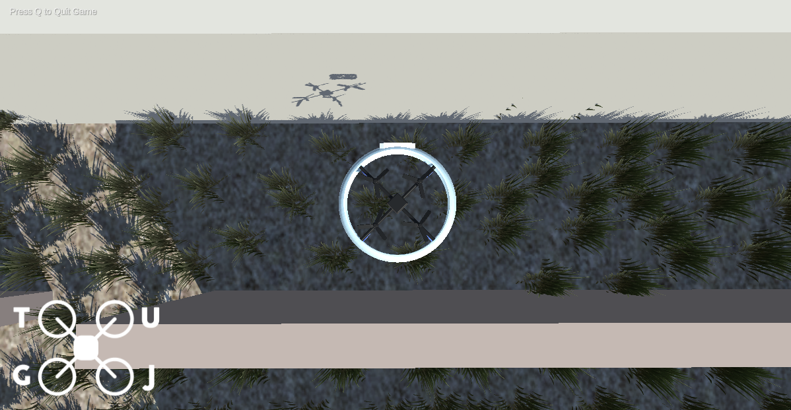
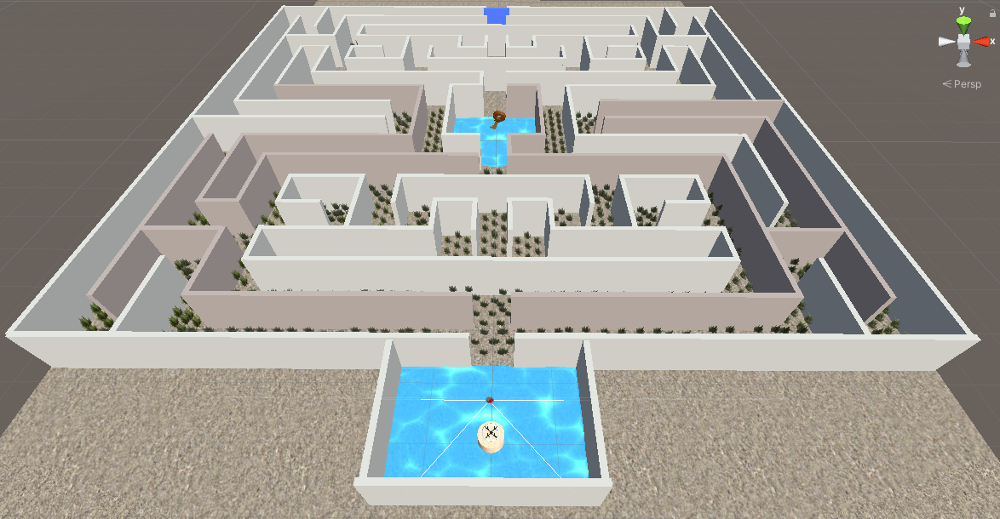
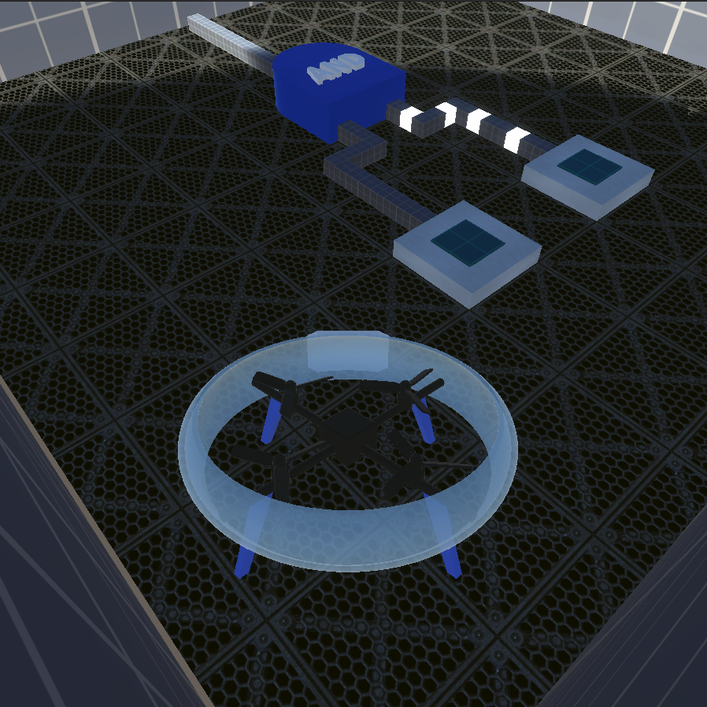
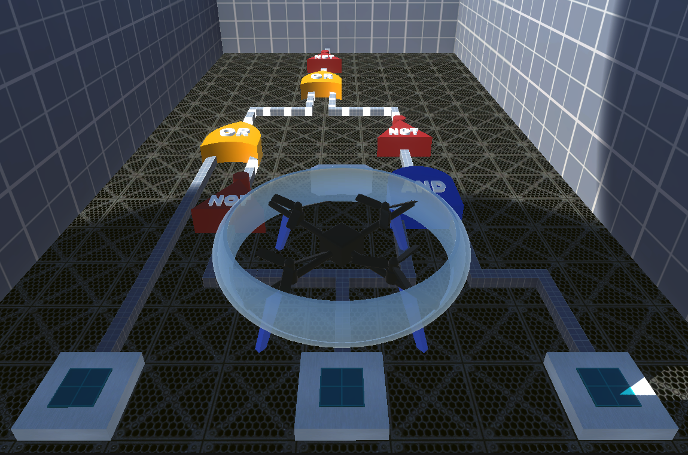
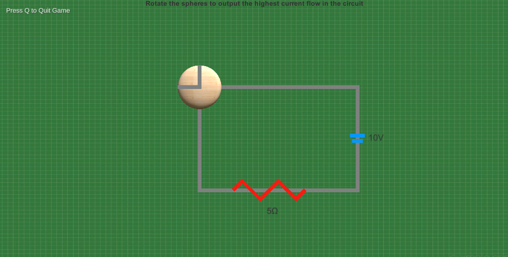
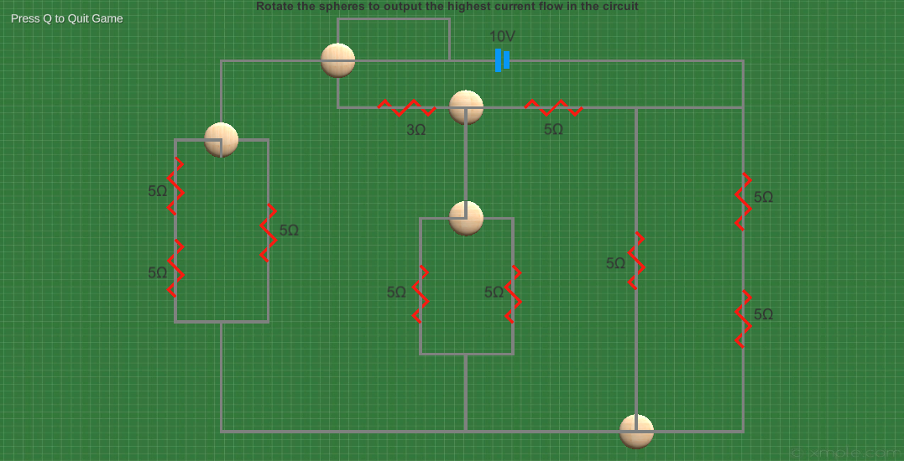

# Jay’s Return

Course: Design for Games & Play II

## Game Description
* The main goal of our game is to introduce and inform prospective students of the TU/e campus and the different studies it provides.
* We try to do so by creating a somewhat recognizable virtual reconstruction of the campus which the player can explore by themselves.
* They do so by flying a drone across campus which serves as a tour guide as well as a companion withits own backstory.
* The goal for the player in the game is to visit and try and experience all of the different studies and to get the drone back to its home.

## Screenshots

Campus

 

Atlas Maze Level

 

Meta Logic Gate Levels 1 and 4

 

Flux Circuit Levels 1 and 4

